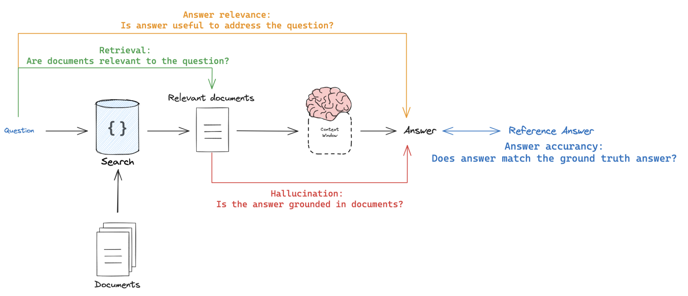

# Azion Edge AI - React Agent

Deploy AI Agents at the edge with Typescript, powered by Azion's Edge Computing Platform. This template uses Langchain's framework to build the AI Agent.

## Setup Instructions

### Prerequisites
1. Create accounts and get API keys from:
   - [Azion](https://www.console.azion.com/)
   - [LangSmith](https://smith.langchain.com/) 
   - [OpenAI](https://platform.openai.com/)
   - [Tavily](https://tavily.ai/)

2. Install Azion CLI
   ```bash
   brew install azion   # For macOS
   # See other options at: https://www.azion.com/en/documentation/products/azion-cli/overview/
   ```

### Installation & Configuration
1. Clone the repository
   ```bash
   git clone git@github.com:aziontech/azion-samples.git
   ```

2. Set up environment:
   - Create `.env` file with API keys
   - Configure project name for LangSmith request tracing

3. Install dependencies:
   ```bash
   yarn install
   ```

4. Install EdgeSQL Python:
   - Clone EdgeSQL repository:
     ```bash
     git clone git@github.com:aziontech/edgesql-shell.git
     ```
   
   - Install system dependencies:
     [mysql-connector-python](https://pypi.org/project/mysql-connector-python/)
     [psycopg2](https://pypi.org/project/psycopg2/)

   - Set up Python environment:
     ```bash
     python -m venv env
     source env/bin/activate
     pip install -r requirements.txt
     ```
   
   - Configure authentication:
     ```bash
     export AZION_TOKEN="your_auth_token_here"
     ```
   
   - Run EdgeSQL Shell:
    For interactive mode:
     ```bash
     python edgesql-shell.py
     ```
    For non interactive mode:
     ```bash
      python3 edgesql-shell.py -n -c ".use MyDB2024" -c ".tables"
      ```
    
    For more information access the [EdgeSQL Shell](https://github.com/aziontech/edgesql-shell) repository.

### Database Setup & Local Development
1. Initialize database:
   ```bash
   yarn setup   # Creates database and tables
   ```
   Note: You can add more data to `products.json` to test hybrid/vector search

2. Run locally:
   ```bash
   azion build
   azion dev
   ```

3. Test local deployment:
   ```bash
   curl 'http://localhost:3333/' \
     --data-raw '{"messages":[{"role":"user","content":"Hello"}],"stream":false}'
   ```

### Production Deployment
1. Deploy to Azion Edge Network:
   ```bash
   azion deploy
   ```
   This creates an Edge application and converts your code into a single Edge Function.

2. Test production deployment:
   ```bash
   curl 'https://<your-new-domain>/' \
     --data-raw '{"messages":[{"role":"user","content":"Hello"}],"stream":false}'
   ```

## Monitoring & Evaluation

### Request Tracing
Monitor requests through LangSmith by selecting your project and viewing traces. See [LangSmith documentation](https://smith.langchain.com/) for details.

### RAG Evaluation

*Source: [LangSmith RAG Evaluation Tutorial](https://docs.smith.langchain.com/evaluation/tutorials/rag)*

#### Evaluation Areas
1. **Retrieval Quality**
   - Compare retrieved documents with questions asked
   - Verify vector database and retriever functionality
   - Check document formatting

2. **Hallucination Detection**
   - Compare retrieved documents with responses given
   - Verify LLM's adherence to source material

3. **Answer Relevance**
   - Evaluate response relevance to questions asked

4. **Reference Answer**
   - Compare against ground truth answers
   - Assess overall correctness

For detailed evaluation examples, see [LangSmith Evaluation Tutorials](https://docs.smith.langchain.com/evaluation/tutorials).

For more information about Langgraph, see the [Introduction to Langgraph](https://academy.langchain.com/courses/intro-to-langgraph) course.